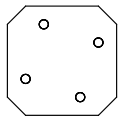
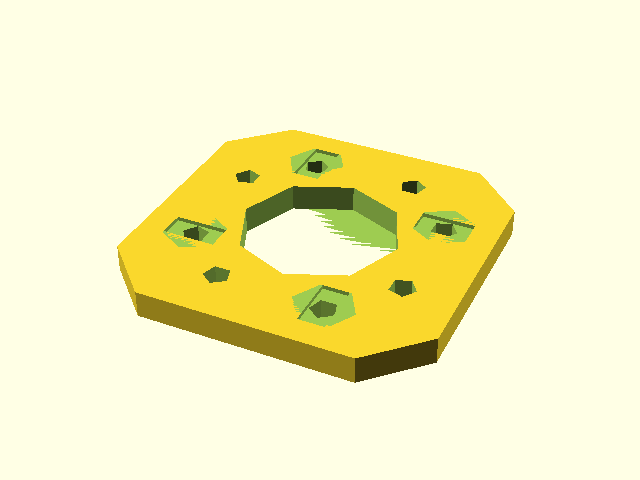
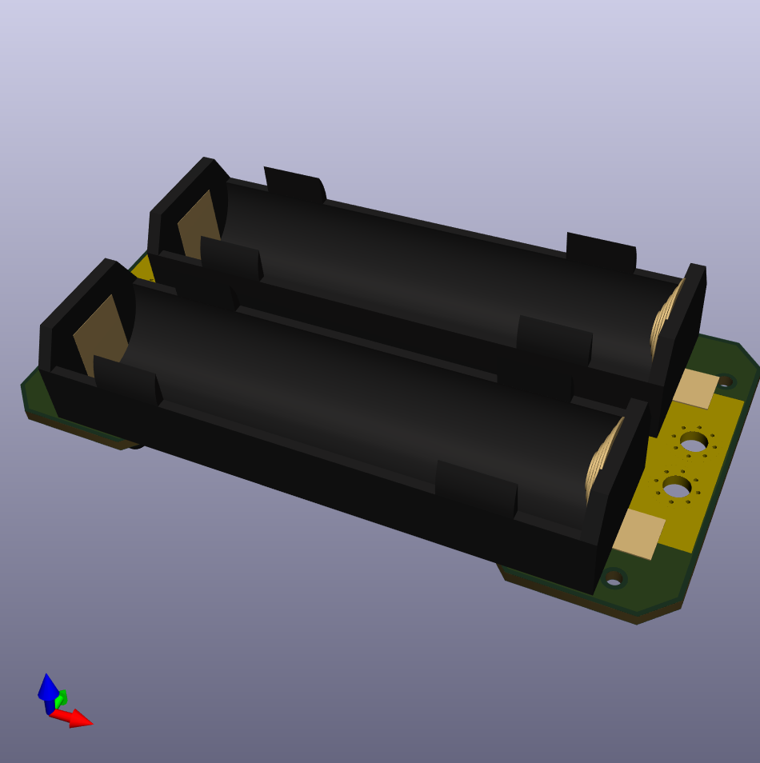
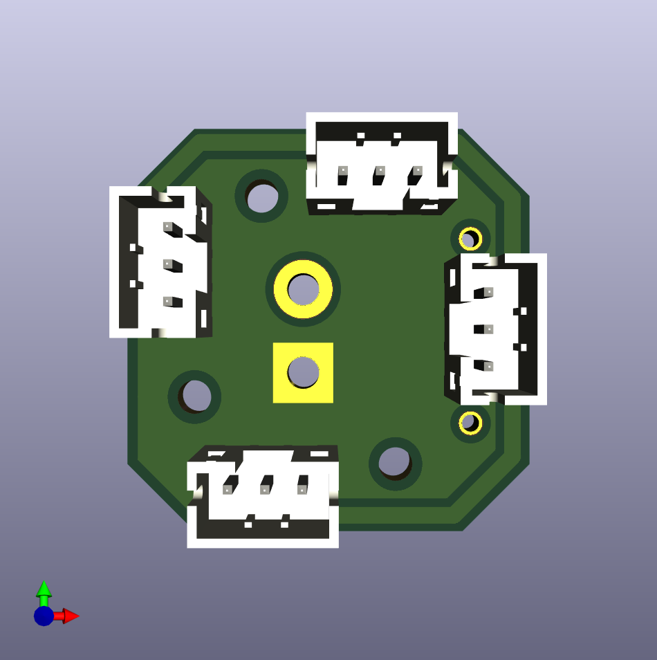
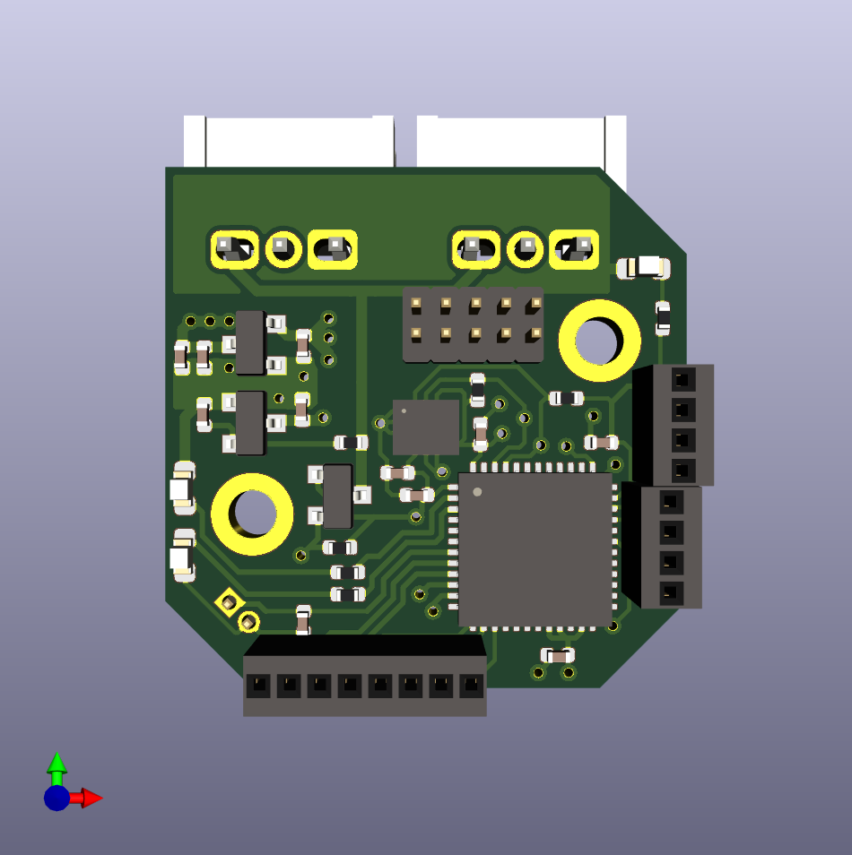
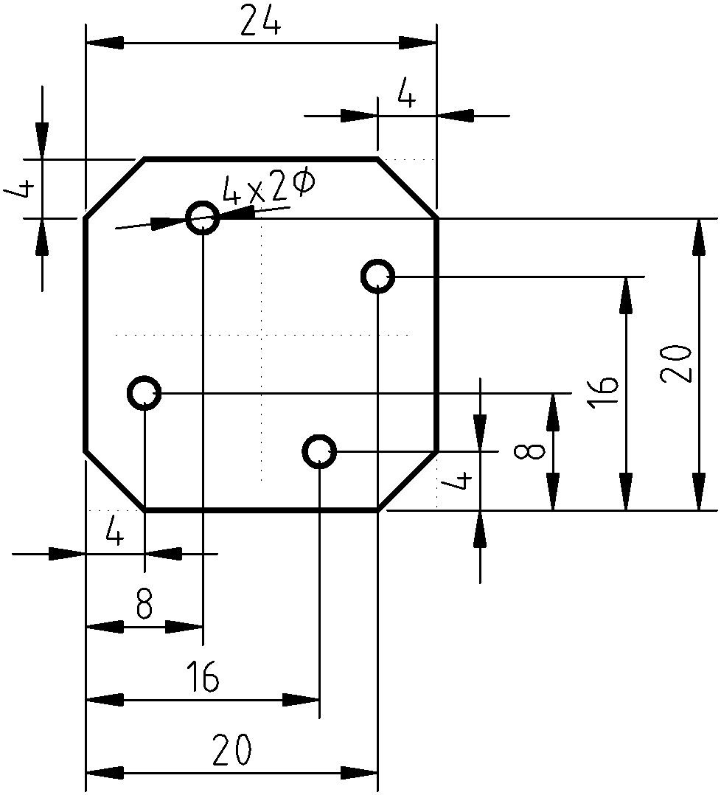

# Tile

Tile is a generic mounting system designed for small robots. 
It is a specification of dimensions of one mount position with positions of four screws.
The idea is that one can attach anything to said position, from 3D printed parts to PCBs.

This gives as abillity to easily reuse parts and rebuild the robot in different configuration easily, same way one could expect from LEGO.
The key difference is that it is more sturdy (as screws are used) and it is easy to make compatible PCB.

We intentially designed the tile to allow mounting of parts on thin wall from both sides.
This is achieved by shifting the holes in a way, that when the shape is flipped, the holes won't collide (even when one uses nuts to screw something in place)

The position is shaped like square with beveled corners, this makes it possible to form a grid of mount positions. 
Bigger parts can overlap multiple tiles, it is up to designed to decided whenever that is sensible choice.
Corners are beveled to create a spot between positions on grid for wires.

Given that we use this for 3D printing, the models expect nuts to be inserted in the models to get proper screw thread.

The most used configuration T24 is 24x24mm square with four positions for M2 screws.

The tile is used in our robot Koke heavily https://schpin.org/robots/koke.html and we allready benefited from this on another robot that just reused a lot of the parts.

## Repository content

The main truth for the tile is it's SCAD library - `tile.scad`.
The rest of the repository is as follows:

 * **dxf/** contains dxf shapes for some grid layous that can be directly imported to other CADs made with SCAD. Note that SCAD approximates circles with n-gon.	
 * **example/** simple examples of tile shapes that can be used
 * **extra/** contains more complex models using tile, such as holder for raspberry or 90degree bracket.
 * **pcb/** PCBs used for our robot designed in KiCAD that are Tile compatible.

## Gallery

### Examples

### PCBs

### Prototype PCBs

## Drawings of T24

All dimensions are in `mm`.

