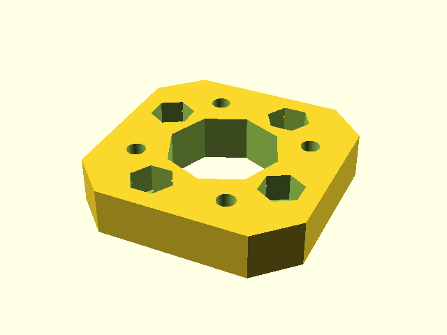

# Tile

Tile is a generic mounting system designed for small robots. 
It is a specification of dimensions of one mount position with positions of four screws.
The idea is that one can attach anything to said position, from 3D printed parts to PCBs.

This gives as abillity to easily reuse parts and rebuild the robot in different configuration easily, same way one could expect from LEGO.
The key difference is that it is more sturdy (as screws are used) and it is easy to make compatible PCB.

We intentially designed the tile to allow mounting of parts on thin wall from both sides.
This is achieved by shifting the holes in a way, that when the shape is flipped, the holes won't collide (even when one uses nuts to screw something in place)

The position is shaped like square with beveled corners, this makes it possible to form a grid of mount positions. 
Bigger parts can overlap multiple tiles, it is up to designed to decided whenever that is sensible choice.
Corners are beveled to create a spot between positions on grid for wires.

Given that we use this for 3D printing, the models expect nuts to be inserted in the models to get proper screw thread.

The most used configuration T24 is 24x24mm square with four positions for M2 screws.

The tile is used in our robot Koke heavily https://schpin.org/robots/koke.html and we allready benefited from this on another robot that just reused a lot of the parts.

## Repository content

The main truth for the tile is it's SCAD library - `tile.scad`.
The rest of the repository is as follows:

 * **dxf/** contains dxf shapes for some grid layous that can be directly imported to other CADs made with SCAD. Note that SCAD approximates circles with n-gon.	
 * **example/** simple examples of tile shapes that can be used
 * **extra/** contains more complex models using tile, such as holder for raspberry or 90degree bracket.
 * **pcb/** PCBs used for our robot designed in KiCAD that are Tile compatible.

## Gallery

### Examples

Simple square with T24 mount on both sides:

### Koke

This is an example of more complex assembly: part of Koke's leg.
You can see that the parts are connected with tiles (such as the tip of the leg) and that there are multiple tile mount spots.

### PCBs

There are two PCBs that are in production stage (that is they may be improved in time but there is little motivation to do so). 
Both are designed in KiCAD and we buy them in bulk.

The first one is small 4-layer power distribution board for use with our servomotors.
The power is brought in usually via the XT30 connector space and we have multiple of these on the robot itself.
We have custom footprint for servoconnectors that is compatible with servomotor connectors with 2.54/2mm spacing with pins in following configuration: S|VCC|GND. 
The idea is that servomotors are connected to free servo connectors and one is left to connect the S| |GND pair to the controller (that is, without the VCC line).

Second board is just really simple holder for two housings for 18650 batteries, that are pararelly connected. 
There are no connectros to be used, rather we expect the wires to be soldered directly on the board itself.

### Prototype PCBs

We have a prototype of board with STM32G4 processor that can be powered from PDB board above.
The board is designed to control our servomotors or to be attached to same communication bus.

The v1 prototype worked (as we could write code for it and blink a LED), but it misses logic level shifter for the servo bus which makes it not really usable.

The v2 fixes that and even adds IMU, however we should switch to smaller package for the processor to fit all on one side of the PCB and we can't do that now given chip shortage, so v2 is delayed until we can do that.

## Drawings of T24

All dimensions are in `mm`.

